# STAR Semantic Scale Experiments

Scale-wise interventions on **STAR d30 at 256×256**. We block cross-attention access to selected semantic text tokens while keeping the full text embeddings and global conditioning unchanged. All generation and metric inference were performed on a RunPod RTX 4090.

## Experiment completed on September 6, 2026

- Validated baseline inference and cross-attention masking while preserving the original STAR `[0]` batch-broadcast behavior.
- Constructed **300 distinct prompts: 50 each for object, color, shape, texture, count, and spatial relation**, using scene themes from CSFM captions. All prompts passed tokenizer and target-span checks.
- Completed **6,600 generations with seed 42**: 20 distinct conditions per prompt plus two diagnostic runs.
- Evaluated **6,000 experimental outputs with LPIPS and CLIPScore**, producing the 12 plots below. Diagnostic repeats are excluded from aggregation. This experiment does not use VQAScore.

[Prompt review](data/csfm50_v1/review.md) · [Per-image metrics](reports/2026-09-06/metrics.jsonl) · [Curve data CSV](reports/2026-09-06/curve_data.csv) · [Numerical summary](reports/2026-09-06/results_summary.json)

## Scale curves

The horizontal axis **k denotes a boundary between scales**, not an additional generation scale. STAR has 10 scales with square token grids of side lengths `1, 2, 3, 4, 5, 6, 8, 10, 13, 16`.

- **Blue — Prefix:** mask scales `1..k`. At k=0 nothing is masked; at k=10 all scales are masked.
- **Orange — Suffix:** mask scales `k+1..10`. At k=0 all scales are masked; at k=10 nothing is masked.
- Lines show the mean over 50 prompts. Shading is the **25th–75th percentile range, not a confidence interval**. Equivalent endpoints reuse the same generation.
- **LPIPS:** perceptual distance from the unmasked image for the same prompt and seed. Higher values mean more image change, not necessarily worse quality.
- **CLIPScore:** alignment with the full original prompt. Higher values mean stronger overall alignment. The dashed line marks the unmasked baseline mean; this is not a target-semantic accuracy measure.

| Semantic | LPIPS | CLIPScore |
|---|---|---|
| **Object** | 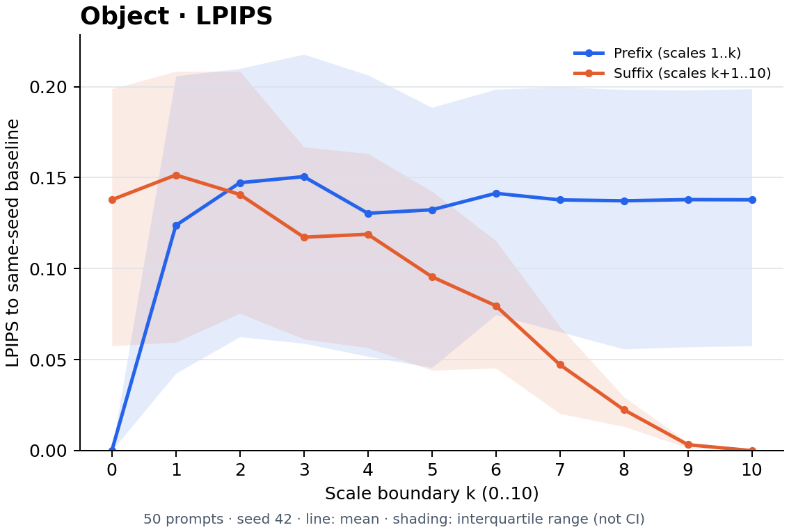 | 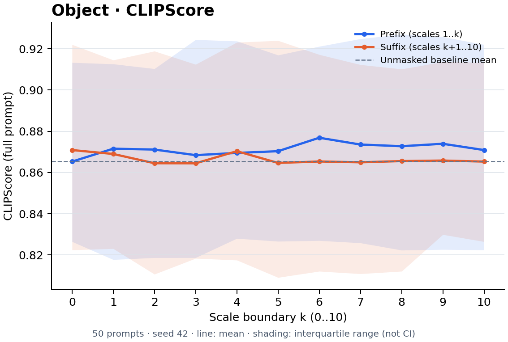 |
| **Color** | 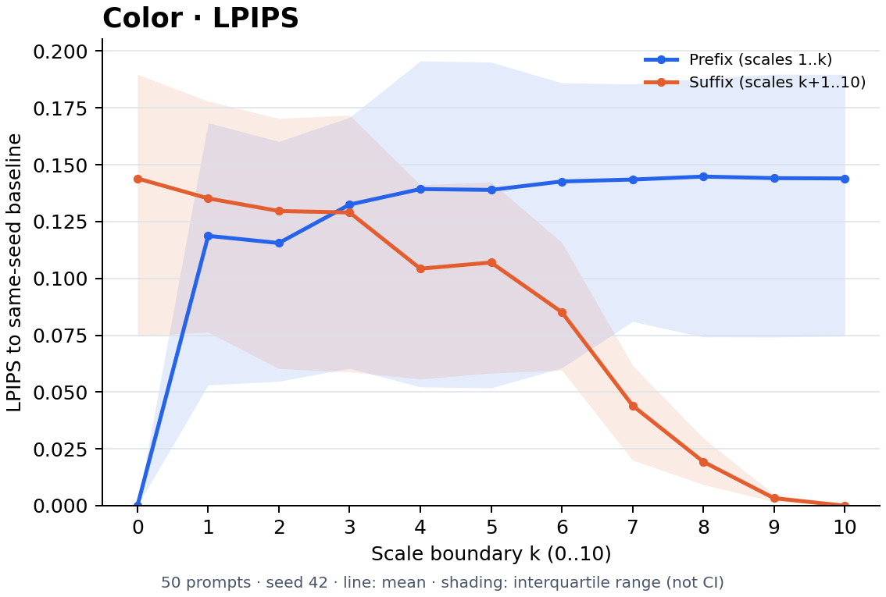 | 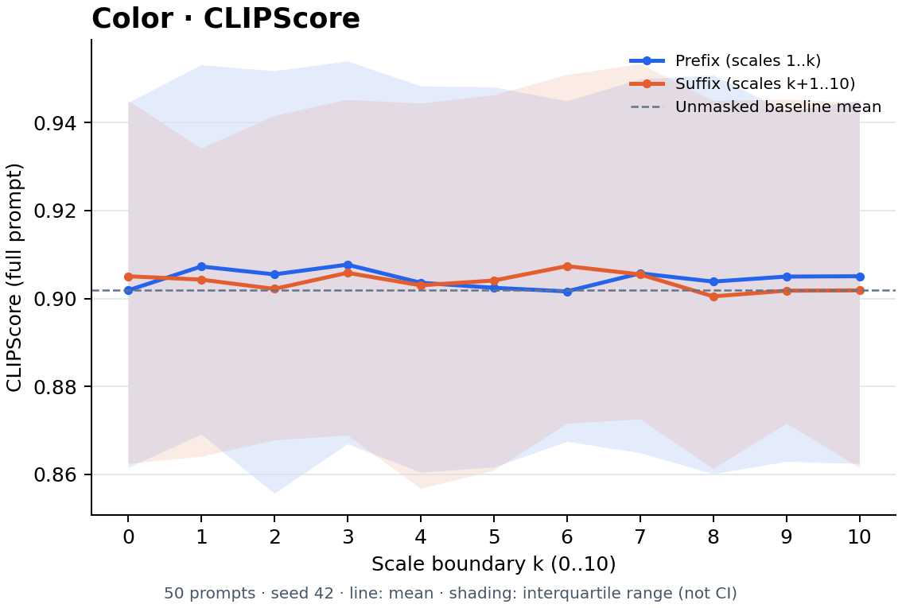 |
| **Shape** | 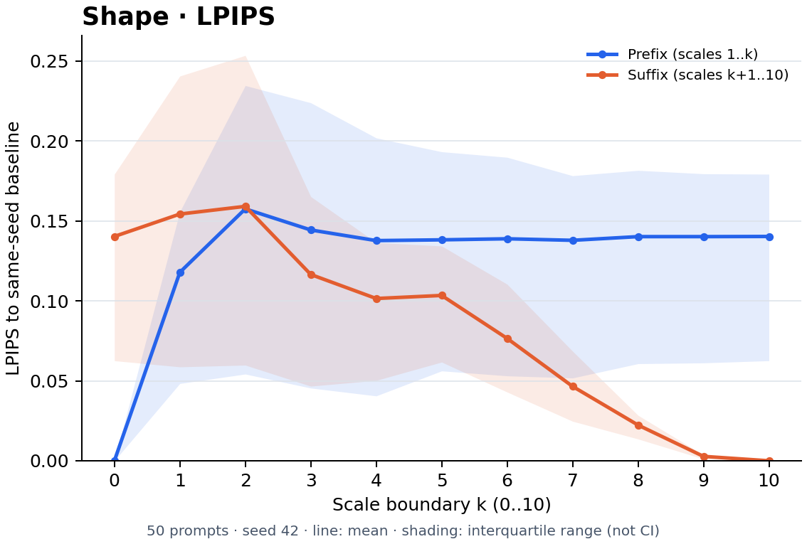 | 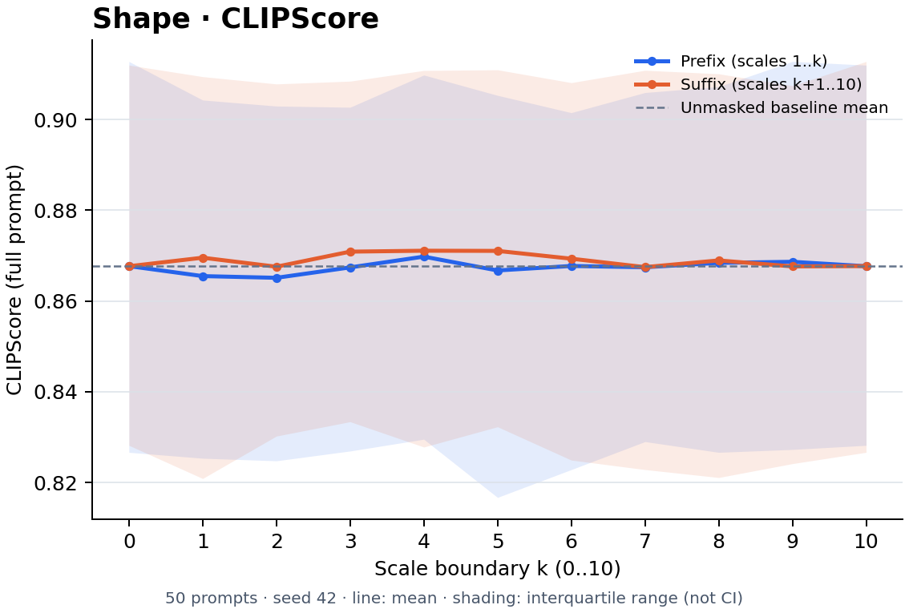 |
| **Texture** | 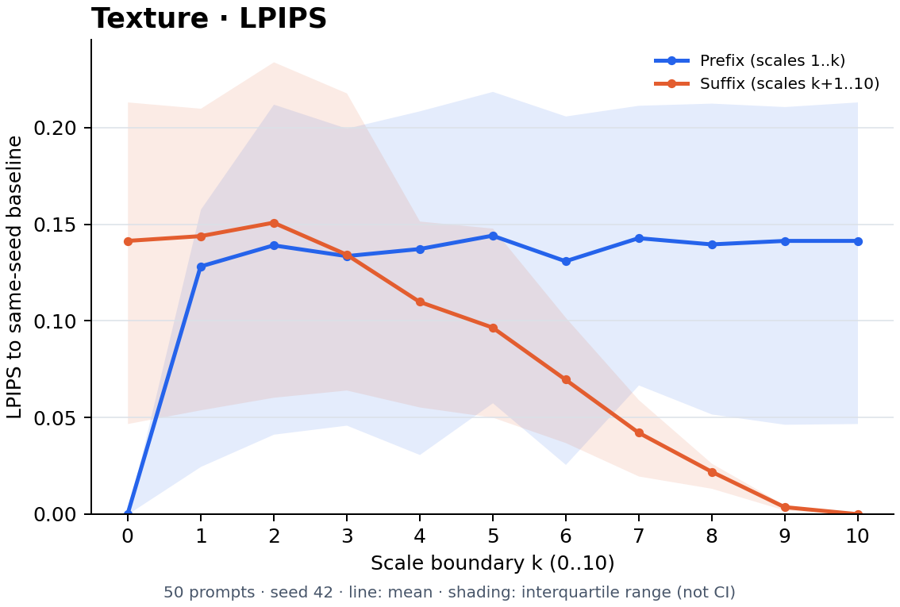 | 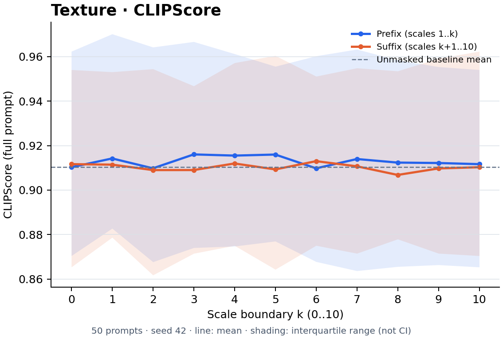 |
| **Count** | 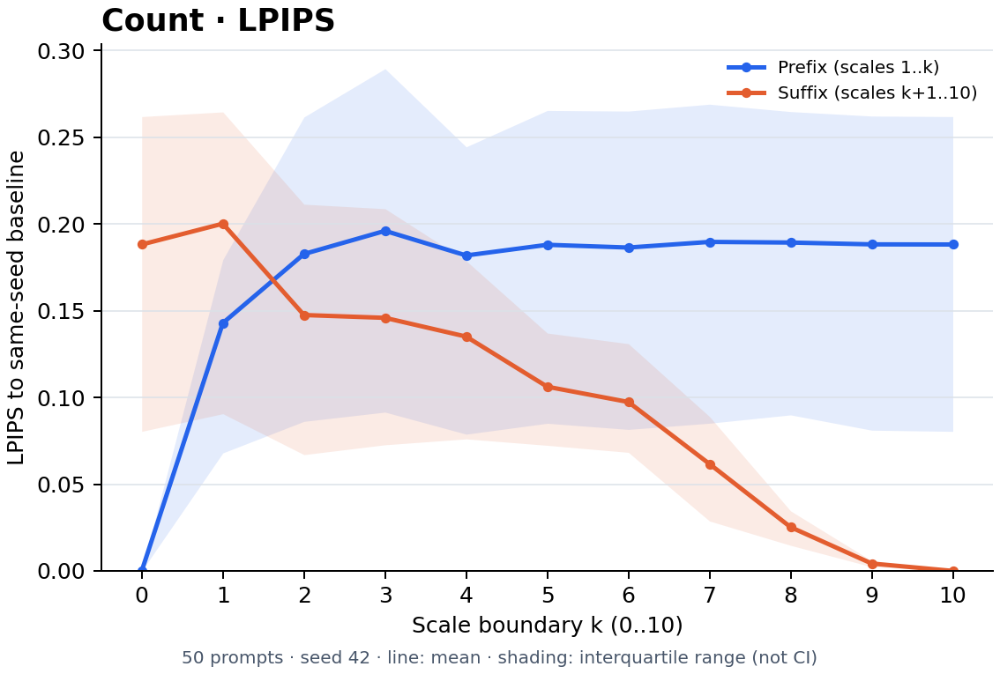 | 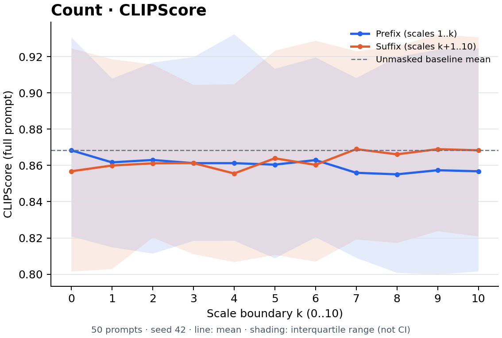 |
| **Spatial relation** | 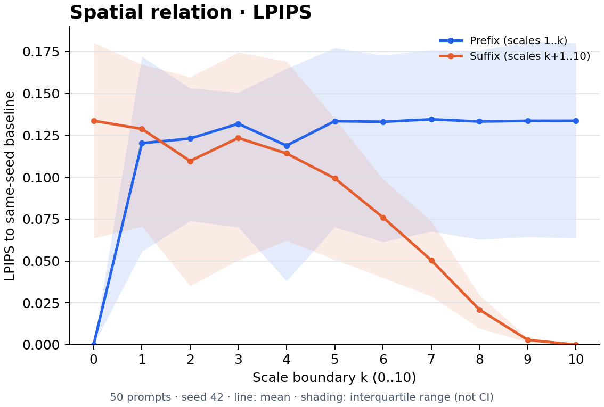 | 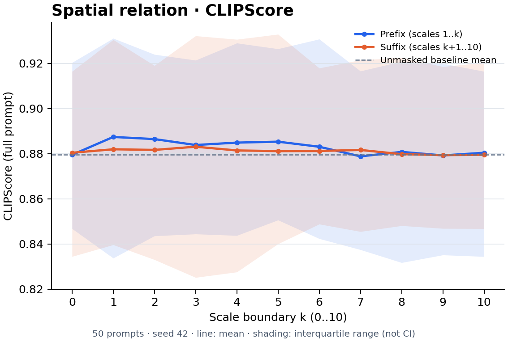 |

Open an image to inspect it at full resolution. Each plot also has a PDF in the same directory; a [12-panel overview](reports/2026-09-06/overview.jpg) is available. Vertical axes are scaled independently, so compare numerical values rather than apparent line heights across panels.

## Observations

1. **Early interventions produce measurable changes in the final image.** Masking only scale 1 yields mean LPIPS values of approximately 0.118–0.143 across the six groups; masking only scale 10 yields approximately 0.0028–0.0043. Suffix distances generally approach zero at later boundaries. Prefix curves are not strictly monotonic.
2. **Full-prompt CLIPScore usually changes little and sometimes increases.** These increases are not evidence of improved semantic correctness. With all scales masked, the count group changes from 0.8683 to 0.8568 in mean CLIPScore, with mean LPIPS 0.1882. These are descriptive observations for this constructed sample, not statistical significance claims.
3. **Perceptual change and full-prompt alignment loss do not necessarily coincide.** These metrics alone do not establish that a target semantic was removed or identify a unique generation scale for each semantic.

Full-mask endpoint means are shown below. `CLIP drop = baseline − full mask`; negative values indicate a score increase.

| Semantic | Baseline CLIPScore | Full-mask CLIPScore | CLIP drop | Full-mask LPIPS |
|---|---:|---:|---:|---:|
| Object | 0.8653 | 0.8709 | -0.0056 | 0.1378 |
| Color | 0.9018 | 0.9051 | -0.0032 | 0.1440 |
| Shape | 0.8677 | 0.8677 | +0.0000 | 0.1403 |
| Texture | 0.9103 | 0.9117 | -0.0014 | 0.1413 |
| Count | 0.8683 | 0.8568 | +0.0116 | 0.1882 |
| Spatial relation | 0.8795 | 0.8804 | -0.0009 | 0.1336 |

## Repository structure

```text
.
├── README.md                       # Experiment report, plots, and reproduction instructions
├── prepare_runpod.sh                # Install generation dependencies; fetch pinned STAR assets
├── requirements.txt                # Generation and tokenizer dependencies
├── requirements-metrics.txt        # LPIPS and pinned OpenAI CLIP dependencies
├── check_baseline.py                # Original vs. corrected batch-behavior diagnostic
├── check_masking.py                 # Scale masking, generation, and implementation checks
├── mask_smoke.json                  # Minimal "A red car." masking test
├── validate_prompts.py              # Check token IDs, context length, and target spans
├── evaluate_metrics.py              # Offline CLIPScore and paired LPIPS evaluation
├── plot_metrics.py                  # Aggregate metrics and export PNG/PDF curves
├── data/
│   ├── README.md                   # Documentation for the initial short-prompt pilot
│   ├── build_pilot.py               # Rebuild that historical pilot
│   ├── pilot_v1*.json / *.md        # Historical pilot inputs, review, and token checks
│   ├── csfm_style_v1/               # Historical 30-target style preview; not used in these curves
│   └── csfm50_v1/                   # Inputs for the reported 300-prompt experiment
│       ├── README.md               # Construction rules, coverage, and limitations
│       ├── build.py                # Deterministic export of hand-specified combinations
│       ├── source_pool.json        # Original caption sample retained for provenance
│       ├── prompts.json            # Canonical input: all 300 prompts and target spans
│       └── review.md               # Human-readable table with mask targets in bold
└── reports/2026-09-06/
    ├── *_lpips.png / *_clipscore.png  # 12 plots embedded above
    ├── *_lpips.pdf / *_clipscore.pdf  # Vector exports of the same plots
    ├── overview.jpg                  # Contact sheet of all 12 plots
    ├── metrics.jsonl                 # 6,000 per-image metric records with condition aliases
    ├── curve_data.csv                # Aggregates underlying every curve point
    ├── results_summary.json          # Baseline and full-mask means by semantic
    ├── generation_manifest.json      # Frozen generation configuration and input snapshot
    ├── generation_summary.json       # Generator completion status
    ├── metric_manifest.json          # Evaluator versions, settings, and script hash
    ├── metric_summary.json           # Evaluator completion and baseline self-checks
    ├── audit_summary.json            # Independently checked generation invariants
    └── token_check.json              # Tokenization and target-position validation
```

**Which files are needed?**

- To generate the reported experiment, use the preparation/dependency files, `check_masking.py`, `check_baseline.py` (also imported for shared constants and source checks), and `data/csfm50_v1/prompts.json`. Run `validate_prompts.py` before using edited inputs.
- To score generated images, use `evaluate_metrics.py`, its dependencies, and the original run directory containing PNGs, `runs.jsonl`, `manifest.json`, and `summary.json`.
- To redraw these plots without running STAR, use `plot_metrics.py` with the committed report directory. It requires NumPy, Matplotlib, and Pillow. See the redraw command below.
- The initial pilot and style preview are **historical records**, not dependencies of the 300-prompt experiment. They are kept to document how the protocol developed.
- PNGs, PDFs, and the overview are deliberate presentation exports. Metric aggregates are reproducible from `metrics.jsonl`; manifests and validation reports preserve the evidence for this completed run.
- The six category-specific JSON copies were removed because they exactly duplicated subsets of `prompts.json`. Filter its `semantic` field when a subset is needed. The build script now exports only the canonical input and review table.

The complete 6,600 original PNGs, detailed generation logs, and model weights are **not stored in GitHub**. They remain under `/workspace` on the RunPod network volume. The committed report supports inspection and replotting; recomputing image metrics requires the original PNGs or a new generation run. Some historical data notes and adaptation annotations remain in Chinese.

## Configuration and validation

| Item | Setting |
|---|---|
| Backbone | Original STAR d30, 256×256; 30 blocks and 10 scales |
| Sampling | seed=42, B=1, CFG=4, top-k=600, top-p=0.8; optional sampler disabled |
| Numerics | FP32 weights, FP16 autocast, math SDP, TF32 disabled |
| Intervention | Set target-key attention bias to −∞ in every cross-attention block/head at selected scales |
| Text conditioning | Full text embeddings and global pooled features fixed; empty-text branch mask unchanged |
| CLIPScore | OpenAI CLIP ViT-B/32; prefix `A photo depicts `; `2.5 × max(cosine, 0)`; FP32 |
| LPIPS | lpips==0.1.4; AlexNet; weight version 0.1; RGB 256×256 in [-1,1] |
| Tested environment | RTX 4090 24GB; Python 3.12.3; torch 2.8.0+cu128; torchvision 0.23.0+cu128 |

**Original `[0]` behavior is preserved.** The upstream block selects the conditional cross-attention output and broadcasts it to both CFG branches. Consequently, both branches receive the intervened conditional cross-attention output. These results do not use the diagnostic implementation that preserves separate batch outputs.

For each prompt, the 20 distinct conditions comprise one unmasked baseline, one full mask, nine intermediate prefixes, and nine intermediate suffixes. Two additional runs check that the hooked baseline matches an unhooked reference and that the full-mask output is reproducible.

The [independent audit](reports/2026-09-06/audit_summary.json) confirms matching reference/no-op hashes, matching full-mask repeats, and unchanged text/global hashes for all 300 inputs. There were 1,890,000 block/scale audit points. Actual QK probabilities were recomputed for the first input of each semantic: 37,800 probability checks, including 19,800 masked checks with exactly zero target weight. Remaining inputs received structural checks, not probability recomputation. All 300 baseline LPIPS self-comparisons and CLIPScore differences passed their checks.

[Generation manifest](reports/2026-09-06/generation_manifest.json) · [Generation summary](reports/2026-09-06/generation_summary.json) · [Metric manifest](reports/2026-09-06/metric_manifest.json) · [Metric summary](reports/2026-09-06/metric_summary.json) · [Token checks](reports/2026-09-06/token_check.json)

## Limitations

- **One seed and controlled combinations.** Prompts are derived from 10 CSFM scene themes with substituted objects, attributes, counts, and relations, rather than 300 independently sampled original captions. Shared wording and scenes introduce dependence; object configurations and target-token lengths are not fully matched across semantics. See the [dataset notes](data/csfm50_v1/README.md).
- **Global and contextual information remain.** Blocking target-token attention access does not remove all information about that semantic from conditioning.
- **Early changes propagate.** Prefix/suffix mask duration varies with k, and earlier interventions have more downstream generation steps. LPIPS differences do not identify isolated semantic-specific scales. No non-target-token placebo control was included.
- **No target-semantic accuracy metric.** LPIPS is sensitive to appearance and layout; full-prompt CLIPScore can obscure local errors. This run contains neither VQA scores nor human success-rate annotations.
- All 300 preconstructed prompts were retained without filtering on generated outputs. Shaded ranges show prompt variability, not evidence of stability across seeds.

## Reproduce on RunPod

Use the tested CUDA torch/torchvision combination above. Generate and evaluate on RunPod; data and documentation can be edited locally. The commands assume an existing checkout and prepared Python environment.

```bash
cd /workspace/star-semantic-experiments
HF_HUB_ENABLE_HF_TRANSFER=0 bash prepare_runpod.sh /workspace/star-baseline-assets
python validate_prompts.py --input data/csfm50_v1/prompts.json \
  --tokenizer /workspace/star-baseline-assets/weights/CLIP/tokenizer \
  --output /workspace/csfm50-token-check.json

# Choose a new output directory for a new run. Generation does not support resume.
python -u check_masking.py --input data/csfm50_v1/prompts.json \
  --output /workspace/star-csfm50-rerun --seeds 42 \
  --weight-audit first-per-semantic

# Separate metric environment: reuse CUDA torch without changing STAR's transformers.
python -m venv --system-site-packages /workspace/star-metrics-env
/workspace/star-metrics-env/bin/python -m pip install --no-deps -r requirements-metrics.txt
/workspace/star-metrics-env/bin/python evaluate_metrics.py \
  --run /workspace/star-csfm50-rerun \
  --output /workspace/star-csfm50-metrics-rerun
/workspace/star-metrics-env/bin/python plot_metrics.py \
  --metrics /workspace/star-csfm50-metrics-rerun \
  --output /workspace/star-csfm50-report-rerun
```

To redraw the committed results without the original images or GPU:

```bash
python plot_metrics.py --metrics reports/2026-09-06 \
  --output /tmp/star-csfm50-redrawn
```

STAR source is pinned to `4ae4492b45bfa1ac24eadcf83c8d474837bfc4b1`; the weight repository is pinned to `23fab671cb225c27a85321309129994498185338`. The reported generation used commit `51aa98f`, evaluation used `5bfa966`, and the published figure layout was introduced in `7e4459a`. Metric evaluation reuses complete stage caches only when their configuration matches. The original run directory is `/workspace/star-csfm50-20260906`.

## Earlier development steps

- **Short-prompt pilot:** 60 semantic targets across 54 distinct prompts. Original baseline inference produced 54×2 images with matching repeats; visual inspection found shape, attribute-binding, and spatial-relation errors.
- **CSFM style preview:** 30 semantic targets across 27 distinct prompts. Text and token checks were completed; this preview was not separately generated.
- The curves on this page use only the subsequent 300-prompt experiment. Neither earlier set is included in its statistics.

## References

- [STAR source](https://github.com/Davinci-XLab/STAR-T2I) / [public weights](https://huggingface.co/taocrayon/STAR)
- [CSFM-ImageNet1K-Caption](https://huggingface.co/datasets/junwann/CSFM-ImageNet1K-Caption): the dataset card declares MIT licensing and captions generated by Qwen3-VL-8B Instruct.
- [CLIPScore implementation](https://github.com/jmhessel/clipscore) / [OpenAI CLIP](https://github.com/openai/CLIP)
- [LPIPS implementation](https://github.com/richzhang/PerceptualSimilarity)
